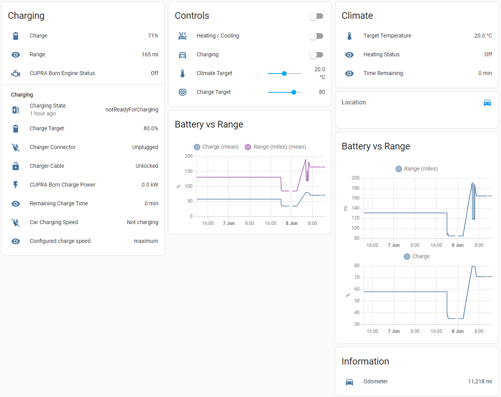
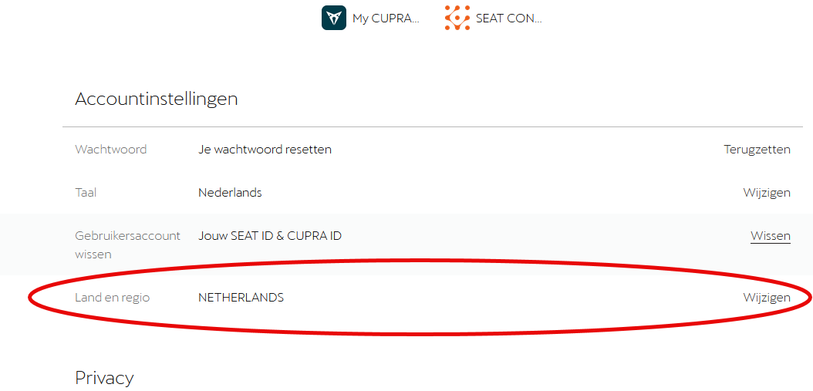

# Cupra WeConnect Home Assistant Integration
[](https://github.com/daernsinstantfortress/cupra_we_connect)
[](https://github.com/daernsinstantfortress/cupra_we_connect/releases/latest)
[](https://github.com/daernsinstantfortress/cupra_we_connect/blob/master/LICENSE)
[](https://github.com/daernsinstantfortress/cupra_we_connect/issues)

_Cupra We Connect ID sensor provides statistics from the Cupra ID Api thru [WeConnect-Cupra-python lib](https://pypi.org/project/weconnect-cupra-daern/)._

**This component will set up the following platforms.**

Platform | Description
-- | --
`sensor` | Show information from your Cupra Born car.
`button` | Start climatization in your Cupra Born car.




## Installation

### Removing old versions
If you were previously running the test version based on [the VW WeConnect ID](https://github.com/tillsteinbach/WeConnect-python/issues/26) version, then this must be completely uninstalled prior to installing this version. You can do this by entering `Settings -> Devices & Services`, opening the small cog next to the Volkswagen WeConnect integration and select "delete". Then remove all files from /custom_components/volkswagen_we_connect_id and reboot HA to complete the job. Don't worry, once you reinstall, everything should come back extactly as it was!

### HACS
The easiest way to add this to your Homeassistant installation is using [HACS](https://hacs.xyz/) and install the "Cupra WeConnect" integration. Once done, follow the instructions under [Configuration](#configuration) below to set it up.

(If the integration doesn't appear, you can manually add https://github.com/daernsinstantfortress/cupra_we_connect as a custom repository. Once done, you can search for "Cupra" and the integration should show up in HACS, allowing installation.)

### Manual

1. Using the tool of choice open the directory (folder) for your HA configuration (where you find `configuration.yaml`).
2. If you do not have a `custom_components` directory (folder) there, you need to create it.
3. In the `custom_components` directory (folder) create a new folder called `cupra_we_connect`.
4. Download _all_ the files from the `custom_components/cupra_we_connect/` directory (folder) in this repository.
5. Place the files you downloaded in the new directory (folder) you created.
6. Follow the instructions under [Configuration](#configuration) below.

Using your HA configuration directory (folder) as a starting point you should now also have this:

```text
custom_components/cupra_we_connect/__init__.py
custom_components/cupra_we_connect/manifest.json
custom_components/cupra_we_connect/sensor.py
.. etc
```

##  Configuration 

It's important that you first use the app, connect the app to the car and use it at least once. 
After that enable the integration on the integration page in Home Assistant with your e-mail and password that you use to login into the app. Wait a couple of seconds and 1 or more devices (your cars) with entities will show up. 

## Authentication Failures

It's important that the username being used to login to this integration has already accepted all of the T&Cs from Cupra. If not, the integration will fail to load with various errors in the logs. The easiest way to do this is as follows:

1. Log in at https://cupraid.vwgroup.io/account
2. Accept any T&Cs prompted
3. Once at the user profile screen, temporarily change your Country and Region to e.g. Belgium (make sure not to change the section for National Identification, but really just the Country and Region).
4. Save it.
5. Log out and log back in.
6. Accept any new terms
7. Change your country back to your country
8. Reload your Cupra integration in HA.



Thanks to user @joostiphone for this hint!

## Tested Cars

* Cupra Born 2021-

## Requirements

Home Assistant Core *2022.7.0* or higher

## Thanks
Many thanks to @mitch-dc for the original implementation of the VW ID integration upon which this is based and @tillsteinbach for the WeConnect python library. In addition, Alan Gibson for the initial work to create this version.
